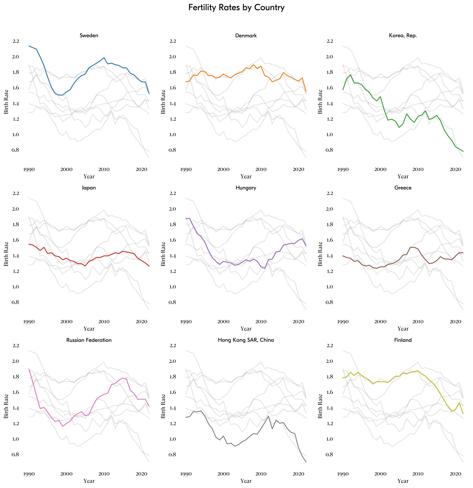

# Birth Rate Policy Impact Analysis

## Project Overview

This project analyzes the causal impact of various policy interventions on birth rates across multiple countries. 

## Countries and Policy Interventions

Below is a list of countries included in this study, along with their respective policy interventions, implementation dates, and sources.

### South Korea
- **Policy Interventions**:
  - Financial incentives for families
  - Expanded maternity leave
  - Increased availability of nurseries
- **Implementation Date**: 2001; 2024 expanded --> 1 million won/month
- **Source**:
  - [South Korea's Plan to Avoid Population Collapse](https://www.thinkglobalhealth.org/article/south-koreas-plan-avoid-population-collapse)
  - [Childbearing and the distribution of the reservation price of fertility: The case of the Korean baby bonus program](https://www.sciencedirect.com/science/article/abs/pii/S104900782100124X)

### Japan
- **Policy Interventions**:
  - Angel Plan to promote child-rearing support
  - Subsidies for epidurals to make childbirth pain relief more affordable
- **Implementation Dates**:
  - Angel Plan: 1994
  - Epidural Subsidies: 2025
- **Sources**:
  - [Japan funds epidurals to boost declining birth rates](https://www.thetimes.co.uk/article/japan-tokyo-women-epidurals-declining-birth-rates-ljcnzxwh0)
  - [Fertility Decline and Policy Development in Japan ](https://www.ipss.go.jp/webj-ad/webjournal.files/population/2006_3/suzuki.pdf)
  - [Japan's Changing Fertility Mechanisms and Its Policy Responses](https://www.jstor.org/stable/41110761)
  - [Fertility Decline and Governmental Interventions in Eastern Asian Advanced Countries](https://www.ipss.go.jp/webj-ad/webjournal.files/population/2009_4/Web%20Journal_02.pdf)

## The following countries were not analyzed as thouroughly, but may be included in some visualizations or comparisons. 

### Hungary
- **Policy Interventions**:
  - Eliminating taxes for mothers with more than three children
  - Reducing credit payments
  - Expanding daycare and kindergarten access
- **Implementation Date**: 2019
- **Source**: [Hungary tries for baby boom with tax breaks and loan forgiveness](https://www.bbc.com/news/world-europe-47192612)

### Greece
- **Policy Intervention**: Cash incentives of $2,235 per birth
- **Implementation Date**: 2020
- **Source**: [World Economic Forum](https://www.weforum.org/stories/2020/02/europe-ageing-population-migration-birthrate/)

### Russia
- **Policy Intervention**: "Maternal capital" program, offering financial incentives to encourage childbirth
- **Implementation Date**: 2006
- **Source**:
  - [Maternity (Family) Capital](https://sfr.gov.ru/en/matcap/)
  - [Assessing the Impact of the Maternity Capital Policy in Russia Using a Dynamic Model of Fertility and Employment](https://docs.iza.org/dp7705.pdf)

### Hong Kong
- **Policy Intervention**: One-time "baby bonus" to encourage childbirth
- **Implementation Date**: 2023
- **Source**: [The Chief Executive's 2023 Policy Address](https://www.policyaddress.gov.hk/2023/en/p113.html)

### Finland
- **Policy Intervention**: Some municipalities, such as Lestijärvi, offered annual payments to mothers for each newborn child (€1,000 per year)
- **Implementation Date**: 2013
- **Source**: [Financial Times](https://www.ft.com/content/2f4e8e43-ab36-4703-b168-0ab56a0a32bc)

### Denmark
- **Policy Intervention**: "Do it for Denmark" campaign encouraging couples to have children.
- **Implementation Date**: 2015
- **Source**: [Do it for Denmark - Wikipedia](https://en.wikipedia.org/wiki/Do_it_for_Denmark)

### Sweden
- **Policy Intervention**: Generous parental leave allowing parents to share 16 months of paid leave per child, with costs divided between employer and state.
- **Implementation Date**: 1974
- **Source**: [Sweden has made it easier to combine career with family life.](https://sweden.se/work-business/working-in-sweden/work-life-balance)

## Methods Used
- **Difference-in-Differences (DiD)**
- **Synthetic Control Method**
- **Doubly Robust Estimation**
- **Causal Graph Visualizations (DAGs)**

## Data Sources
- World Bank (Birth rate, GDP, Education)
- Government Policy Announcements
- Research Papers on Causal Inference in Demographics
